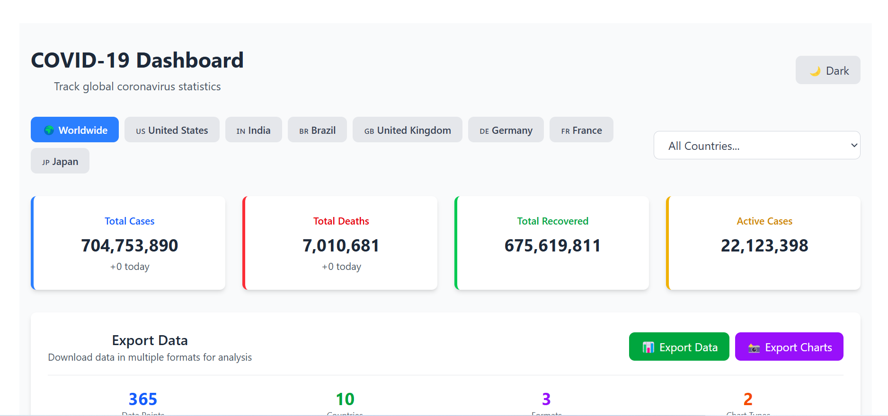

# 🦠 COVID-19 Data Visualization Dashboard




A professional dashboard for visualizing and analyzing global COVID-19 data with advanced export capabilities and interactive visualizations.

## ✨ Features

- 📈 **Interactive Charts** - Historical trends and country comparisons
- 🌍 **World Map Visualization** - Color-coded case intensity mapping
- 📤 **Data Export** - CSV, Excel, and PNG downloads
- 🌙 **Dark/Light Theme** - System preference detection
- 📱 **Fully Responsive** - Mobile-first design
- ⚡ **Real-time Data** - Live API integration
- 🎯 **Country Drill-down** - Click map to explore country data

## 🚀 Quick Start

```bash
# Clone and install
git clone https://github.com/yourusername/covid-dashboard.git
cd covid-dashboard
npm install

# Start development
npm run dev

# Build for production
npm run build
```

## 🛠️ Built With

- **React** - Frontend framework
- **Vite** - Build tool and dev server
- **Tailwind CSS** - Styling framework
- **Recharts** - Data visualisation
- **React Simple Maps** - Geographic data
- **disease.sh API** - COVID-19 data source

## 🗒️ License

MIT ©️ Elizabeth Kodjo
