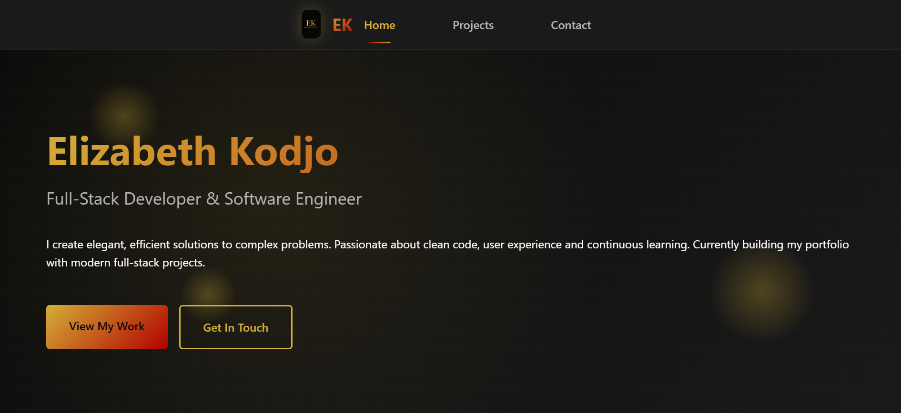

# EK Portfolio - Full-Stack Developer Portfolio

_A modern, responsive portfolio website showcasing full-stack development skills_

## 🚀 Live Demo

- **Frontend**: [https://your-domain.com](https://your-domain.com)
- **Backend API**: [https://api.your-domain.com](https://api.your-domain.com)

## ✨ Features

- **🎨 Modern Design**: Dark theme with custom reddish-gold color scheme
- **📱 Fully Responsive**: Optimized for desktop, tablet, and mobile devices
- **⚡ Fast Performance**: Built with React + Vite for optimal loading speeds
- **🔧 Full-Stack Architecture**: React frontend with FastAPI backend
- **📊 Project Showcase**: Filterable project gallery with status indicators
- **📧 Contact Form**: Functional contact form with backend integration
- **📄 Resume Download**: Easy resume/CV download functionality
- **🎯 SEO Optimized**: Proper meta tags and structured data
- **🧪 Testing**: Comprehensive test suites for both frontend and backend

## 🛠️ Tech Stack

### Frontend

- **React 18** - Modern React with hooks
- **Vite** - Fast build tool and dev server
- **SCSS** - Advanced styling with variables and mixins
- **React Router** - Client-side routing
- **Axios** - HTTP client for API calls

### Backend

- **FastAPI** - Modern, fast Python web framework
- **SQLModel** - SQL database toolkit with Pydantic integration
- **SQLite** - Development database (easily switchable to PostgreSQL)
- **Pydantic** - Data validation and settings management
- **Uvicorn** - ASGI server

### Development & Deployment

- **Testing**: Vitest (frontend), Pytest (backend)
- **Environment Management**: Python dotenv
- **Containerization**: Docker-ready configuration

## 🗒️ License

This project is licensed under the MIT License

## 🙏 Acknowledgements

- Design inspiration from modern developer portfolios
- FastAPI for the excellent documentation and performance
- React community for extensive component ecosytem
- Vite team for the fantastic build tool

### Built with 💖 using React, FastAPI and modern web technologies
